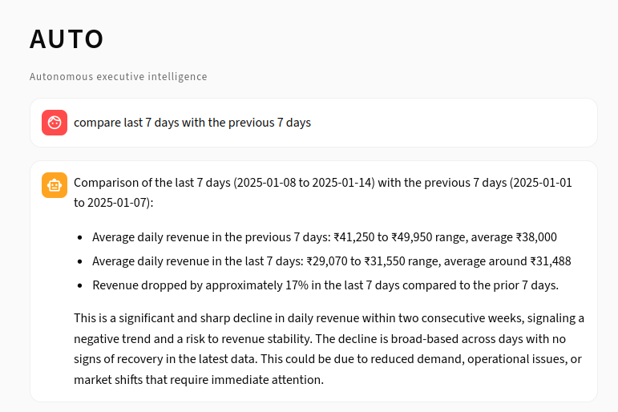

# Case Study 1: Sudden Demand Drop and Revenue Shock Detection

## Overview
Test whether the Company OS can detect and correctly classify a sudden revenue decline as a material business risk.


---

## Context
A deliberate demand contraction was introduced across all core SKUs to test system robustness under adverse conditions.

---

## Hypothesis
**A sudden drop in baseline demand should be detected as a material revenue shock and framed with executive-level implications rather than treated as normal variance.**

---

## Shock Injection (Controlled Simulation)

### What Changed
Baseline daily demand was uniformly reduced across all products to simulate a sudden market-driven contraction:

```python
BASE_DAILY_DEMAND = {
    "Nutrain Vanilla": 75,        # was 120
    "Nutrain Choco Coffee": 55,   # was 90
    "Nutrain Banana Oats": 40,    # was 60
}
```

## System Response

### Executive Prompt

> **"Compare the last 7 days with the previous 7 days."**

No additional context, thresholds, or instructions were provided.

---

### Signal Interpretation
- Detected a **~17% week-over-week revenue decline**
- Classified the change as a **material short-term revenue shock**
- Escalated the issue for deeper analysis rather than proposing immediate actions

---

### System Output (Summary)
- Explicit 7-day vs 7-day comparison
- Quantified decline (~17% WoW)
- Framed as a significant revenue and cash flow risk



---

### Limitations
Ambiguous time references (e.g. “this week vs last week”) produced different interpretations, highlighting the need for explicit temporal definitions in high-impact queries.

---

### Takeaway
The Company OS correctly detected a sudden demand shock and framed it as a material business risk using explicit temporal reasoning.


# Case Study 2: Demand surge Under Production Constraints

## Objective
Test inventory resilience when **demand increases while production capacity falls**, simulating a realistic scale-up failure scenario.

---

## Scenario
- **Previous week:** Baseline operations
- **Recent week:** Demand surge + reduced production

### Configuration Changes

**Increases Demand**
```python
BASE_DAILY_DEMAND = {
    "Nutrain Vanilla": 170,      # was 120
    "Nutrain Choco Coffee": 130, # was 90
    "Nutrain Banana Oats": 85,   # was 60
}
```
**Reduced Production capacity**
```python
PRODUCTION_RANGE = {
    "Nutrain Vanilla": (95, 110),     # was (105,135)
    "Nutrain Choco Coffee": (70, 90), # was (80, 105)
    "Nutrain Banana Oats": (50,65),   # was (55, 75)
}
```
**Lower demand volatility**
```python
DEMAND_NOISE = (0.95, 1.05)
```
## Inventory Impact (Week-over-Week)

**Key Insight:** 
Stockout frequency remained unchanged, but financial damage per stockout increased materially.


### SKU Impact

**Nutrain Choco Coffee**
- Stockout days: 4 -> 4
- Revenue loss on stockout days: ~46.6% -> ~58.0%

**Nutrain Vanilla**
- Stockout days: 4 -> 4
- Revenue loss on stockout days: ~25.7% -> ~42.1%


## Root Cause Analysis
- Demand exceeded maximum production capacity.
- High-velocity SKUs depleted inventory fastest.
- No dynamic production prioritization for revenue-critical products.
- Lack of buffer for growth-driven volatility.

## Business Impact
- Lost revenue concentrated in top-performing SKUs.
- Increased customer dissatisfaction risk
- Growth exposed operational fragility rather than scaling performance.

## Takeaway
Growth without supply reinforcement amplified revenue loss instead of value creation. The system correctly identified worsening impact despite stable stockout counts - a critical scaling failure signal.

# Case Study 3: Unhealthy Growth from Channel Inefficiency

## Objective
Test whether the system can detect **revenue that appears healthy but is driven by unprofitable marketing channels**, creating structural risk.

---

## Scenario
Two consecutive weeks were simulated:

- **Baseline week:** Normal channel efficiency
- **Treatment week:** Rising acquisition costs and declining efficiency in key channels.

All other variables (demand, pricing, production) remained constant.

---

## Channel Efficiency Change

```python
CHANNEL_BEHAVIOR = {
    "Instagram": {"ctr": (0.010, 0.020), "cvr": (0.020, 0.035), "cpc": (4.0, 7.0)},
    "Google": {"ctr": (0.025, 0.050), "cvr": (0.030, 0.060), "cpc": (20.0, 32.0)},
    "Influencers": {"ctr": (0.004, 0.010), "cvr": (0.010, 0.020), "cpc": (14.0, 24.0)}
}
```
## Executive Prompt

- **Is our growth healthy?**
- **Compare the last 7 days with the previous 7 days.**

No guidance or thresholds were provided.

## Key Findings


### Revenue and Growth
- Daily revenue fell ~24% vs recent baseline
- No sustained positive growth detected
- Growth quality classified as NEUTRAL/ UNHEALTHY

### System Response
- Avoided assigning a single root cause
- Flagged blended metrics masking inefficiency
- Escalated risks around cash burn and channel dependency
- Framed issue as structural, not short-term noise

### Takeaway
Revenue contribution masked deteriorating unit economics. The system correctly identified unhealthy growth driven by value-destructive channels, despite multi-channel revenue presence.